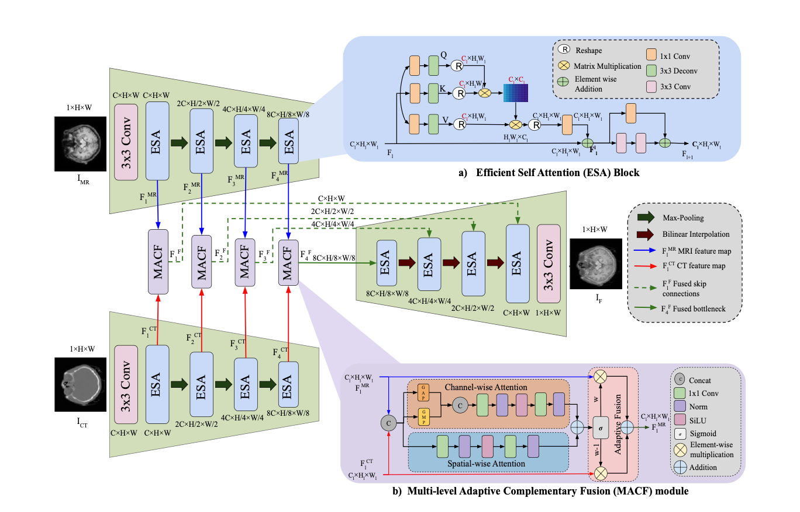
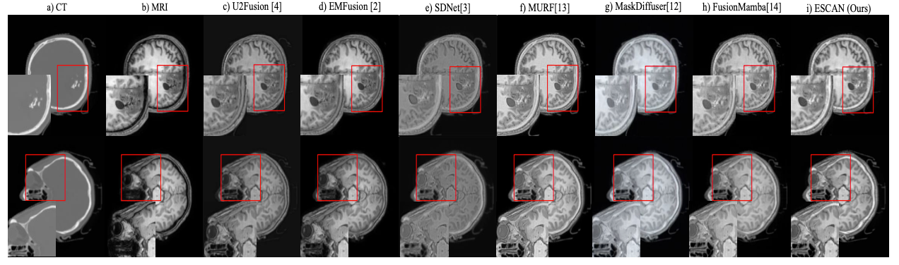

<div align="center">
    <h1>
    ESCAN: Effective Structural Context Attention Network for Medical Image Fusion
    </h1>
    <div>
    <a href='#' target='_blank'>Munish Daroch<sup>1*</sup></a>&emsp;
    <a href='#' target='_blank'>Alan Saldanha<sup>2*</sup></a>&emsp;
    <a href='#' target='_blank'>Ranjeet Ranjan Jha<sup>3</sup></a>&emsp;
    <a href='#' target='_blank'>Aditya Nigam<sup>1</sup></a>
</div>

<div>
    <sup>1</sup> Indian Institue of Technology Mandi <br>
    <sup>2</sup> Dwarkadas Jivanlal Sanghvi College of Engineering <br>
    <sup>3</sup> Indian Institue of Technology Patna
</div>
<div>
    <sup>*</sup>Equal Contribution <br>

</div>
    <br>
    
<!-- [](#)
[](#)
[](#)
[](#) -->

</div>

> **Abstract:** *Medical image fusion plays a crucial role in clinical diagnosis and treatment planning by combining the complementary information of different imaging modalities (e.g., MRI, CT, PET). In this paper, we propose the Effective Structural Context Attention Network (ESCAN) to fuse medical images while optimally preserving fine-grained structural details and vital metabolic intensities. Extensive experiments demonstrate that ESCAN achieves state-of-the-art qualitative and quantitative performance.*

---

## 📢 Updates
* **[Coming Soon]** Pretrained Weights.
* **[2026-01-26]** Core files and architecture added.

---

## 🚀 Framework
Our proposed ESCAN framework leverages structural context and specialized attention mechanisms to effectively extract and fuse multi-modal features.

<p align="center">
  
</p>
<p align="center"><em>Figure 1: The overall architecture of the proposed ESCAN.</em></p>

---

## 📊 Results

### Qualitative Comparison
ESCAN generates fused images that maintain the sharp structural boundaries of MRI while highlighting the critical intensity regions from the CT modality.

<p align="center">
  
</p>
<p align="center"><em>Figure 2: Comparison of results against existing models.</em></p>


---

## 🛠️ Setup & Installation

**1. Clone the repository**
```
git clone https://github.com/a-saldanha/ESCAN.git
cd ESCAN
# create an environment having python >= 3.8 
pip install -r requirements.txt
```

**2. Install dependencies**
Ensure you have PyTorch installed, then run:
```bash
pip install -r requirements.txt
```

---

## 💻 Usage

### Data Preparation
Organize your dataset and run the preprocessing script to align the modalities:
```bash
python scripts/preprocess_dataset.py --input_dir /path/to/raw --output_dir /path/to/processed
```

### Training
You can train the ESCAN model using the standard script or our optimized training pipeline with the provided configurations.
```bash
python training_with_logs.py --config config.yaml
```
*Note: Training logs and checkpoints will be saved in the `experiments/` directory.*

### Inference / Testing
To test the model and generate fused slices using our best pre-trained weights (`escan_best_model.pth`):
```bash
python inference.py --weights experiments/ESCAN_mmdd_hh-mm_L1-a_L2-b_L3-c/escan_best_model.pth --input_dir /path/to/test_data --output_dir escan_results/
```

---

## 📁 Repository Structure
```text
ESCAN/
├── config.yaml               # Training hyperparameter configurations
├── train.py                  
├── training_with_logs.py
├── inference.py              
├── src/
│   ├── models/
│   │   ├── network.py        # Main ESCAN network definition
│   │   └── escan_modules.py  # Core architectural modules
│   ├── utils/
│   │   ├── loss.py           
│   │   └── metrics.py        
│   └── data/
│       └── loader.py         # PyTorch Dataset and DataLoader
├── scripts/
│   └── preprocess_dataset.py # Data preparation
└── experiments/              # Model checkpoints
```

---

<!-- ## 📝 Citation
If you find this work useful in your research, please consider citing our paper:
```bibtex
@article{YourName2024ESCAN,
  title={ESCAN: Effective Structural Context Attention Network for Medical Image Fusion},
  author={Your Name and Co-authors},
  journal={Journal Name},
  year={2024}
} -->
```

## 📧 Contact
For any questions, feel free to open an issue or contact alan@a-saldanha.me
